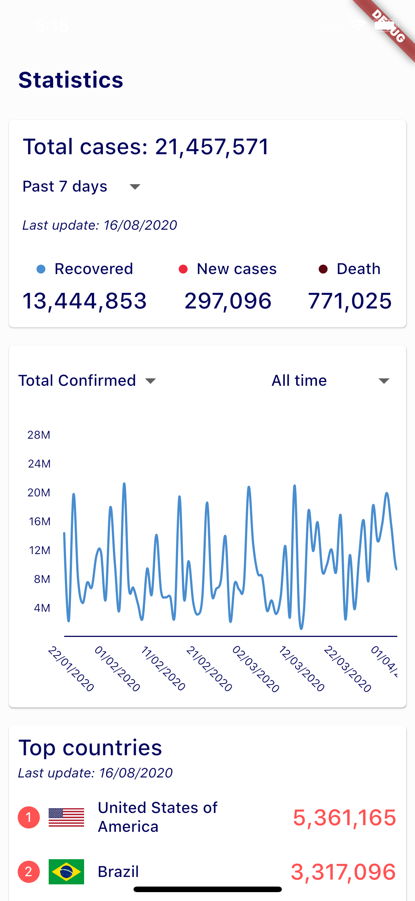

# Covid 19 Statictis

A simple Flutter project for [Flutter UI Challenge #1](https://docs.google.com/forms/d/e/1FAIpQLSeIy3Ov8IjzK42Xc2x__g-T0hbjnNJAyySfyc36GlEGQ_HUeg/viewform)

## 💻 Install

**Note**: Make sure your [Flutter](https://flutter.dev) environment is setup.

In the command terminal, run the following commands:

    $ https://github.com/jyuviolegrace-slayer/flutter-ui-challenge-1.git flutter_covid
    $ cd flutter_covid/
    $ flutter packages get
    $ flutter run

## 📷 Screenshots

# Video demo

- [IPhone 11](https://www.dropbox.com/s/n8knebnsc71m09r/demo.mov?dl=0)

# References

- [Covid19 API](https://covid19api.com/)
- [Rive](https://rive.app/)
